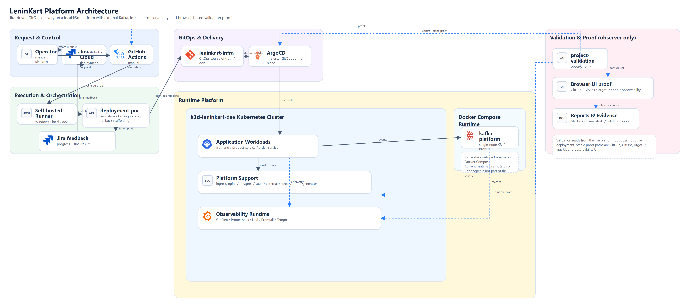
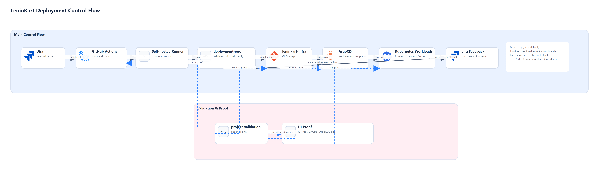
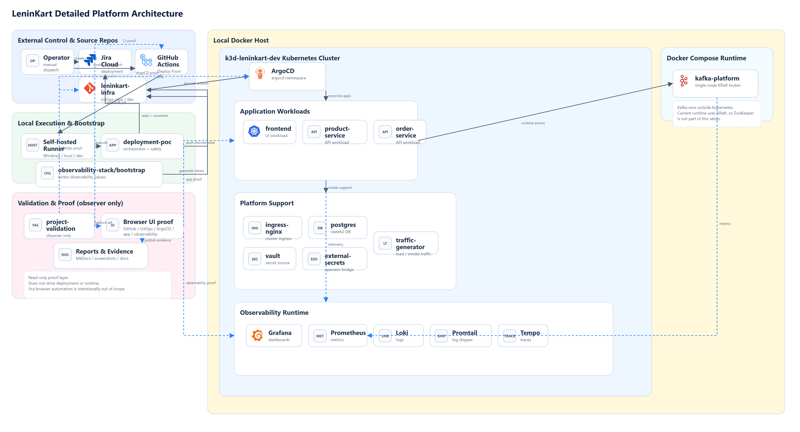

# LeninKart Deployment POC

Reusable Jira-driven deployment orchestration for the LeninKart dev platform, built around GitHub Actions, a Windows self-hosted runner, GitOps in `leninkart-infra`, and ArgoCD running on a local `k3d` cluster.

## Why This Project Exists

This repository exists to demonstrate a practical deployment control plane that starts from a Jira ticket and drives a real GitOps-based deployment flow without embedding deployment logic inside the application repos.

It solves a few concrete problems:

- deployment intent is captured in Jira instead of being passed around informally
- deployment logic stays separate from application source code
- GitOps remains the source of truth through `leninkart-infra`
- ArgoCD reconciliation is verified against the exact pushed revision
- Jira gets progress updates and final deployment feedback
- operational safety is built in through state, locks, idempotency, stale-lock recovery, and rollback scaffolding

## System Overview

LeninKart currently consists of:

- business applications
  - `leninkart-frontend`
  - `leninkart-product-service`
  - `leninkart-order-service`
- deployment and GitOps layer
  - `deployment-poc`
  - GitHub Actions
  - self-hosted runner `leninkart-runner`
  - `leninkart-infra` on branch `dev`
  - ArgoCD in the local `k3d-leninkart-dev` cluster
- platform support layer
  - `kafka-platform`
  - `observability-stack`
- validation and proof layer
  - `project-validation`

The current trigger model is intentionally explicit:

- a Jira ticket is created manually
- the GitHub Actions workflow `.github/workflows/deploy-from-jira.yml` is dispatched manually with the Jira ticket key
- the self-hosted runner executes the deployment
- Jira receives stage-wise progress comments and final deployment feedback

This is not currently an automatic Jira-webhook-triggered system. That distinction is important and intentional in the current README.

## Architecture

### Platform Architecture



The README-facing showcase view is the fastest way to explain the platform in GitHub, LinkedIn, or interviews. It highlights the real control path, GitOps delivery path, runtime boundary, external Kafka placement, and the validation sidecar without overloading the image.

The corrected platform model has six distinct boundaries:

- external control and source repos
  - Jira Cloud for deployment intent
  - GitHub Actions manual dispatch
  - GitHub-hosted `leninkart-infra/dev` as the GitOps source of truth
- local execution and bootstrap
  - the Windows self-hosted runner
  - `deployment-poc` orchestration and safety logic
  - `observability-stack/bootstrap` generating observability values into GitOps
- local Docker host
  - `k3d-leninkart-dev` as the Kubernetes cluster runtime
  - a separate Docker Compose runtime for Kafka
- in-cluster control plane and runtime
  - ArgoCD inside the cluster
  - app workloads: frontend, product-service, order-service
  - in-cluster support: ingress, Postgres, Vault, External Secrets, loadtest
  - in-cluster observability runtime: Grafana, Prometheus, Loki, Promtail, Tempo
- external runtime dependency
  - `kafka-platform` running outside Kubernetes via Docker Compose
- validation and proof
  - `project-validation` as a read-only observer for GitHub, GitOps, ArgoCD, app UI, and observability evidence

### Deployment Flow



The focused deployment path is:

`Jira ticket -> workflow_dispatch -> self-hosted runner -> deployment-poc -> leninkart-infra/dev -> ArgoCD -> Synced + Healthy -> Jira feedback`

### Detailed Platform Architecture



Use the detailed view when you want the real component inventory rather than the higher-level boundary overview. It expands:

For diagram roles and file locations, see [docs/architecture/ARCHITECTURE_DIAGRAM_GUIDE.md](docs/architecture/ARCHITECTURE_DIAGRAM_GUIDE.md).

- application workloads
- platform support components
- observability runtime components
- Docker Compose Kafka placement
- validation/proof as a separate observer layer

## Repositories Involved

| Repo / workspace | Branch | Current role |
| --- | --- | --- |
| `deployment-poc` | `main` | Jira-driven deployment orchestrator and safety layer |
| `leninkart-infra` | `dev` | GitOps source of truth for the dev environment |
| `leninkart-frontend` | `dev` | Frontend application |
| `leninkart-product-service` | `dev` | Product API service |
| `leninkart-order-service` | `dev` | Order API service |
| `kafka-platform` | `main` | Kafka runtime and messaging support |
| `observability-stack` | workspace bootstrap | Generates values and assets for Grafana, Prometheus, Loki, Tempo, and Promtail |
| `project-validation` | `main` | Validation, screenshot proof, MkDocs-ready reporting |

## Supported Services

The currently validated dev deployables are:

- `frontend`
- `product-service`
- `order-service`

These are mapped in [config/app_mapping.yaml](config/app_mapping.yaml) through:

- Jira-facing aliases
- GitOps values file paths
- ArgoCD app names
- namespace mappings
- environment URLs
- version aliases such as `v1` and `v2`

Live multi-service validation is documented in [docs/POC_MULTI_SERVICE_VALIDATION_REPORT.md](docs/POC_MULTI_SERVICE_VALIDATION_REPORT.md).

## End-to-End Deployment Flow

1. A Jira ticket is created with deployment metadata in the description.
2. GitHub Actions `workflow_dispatch` starts `.github/workflows/deploy-from-jira.yml`.
3. The job lands on the Windows self-hosted runner with labels:
   - `self-hosted`
   - `Windows`
   - `X64`
   - `leninkart`
   - `local`
   - `dev`
4. `deployment-poc` fetches the Jira issue through the Jira API.
5. The ticket description is parsed into structured deployment metadata.
6. Validation checks the environment, component, version, and target mapping.
7. The orchestrator resolves the GitOps target in `leninkart-infra/dev`.
8. A deployment lock is acquired.
9. The target `values-dev.yaml` file is updated and committed when a new deployment is needed.
10. ArgoCD reconciliation is verified against the exact GitOps commit.
11. Post-checks run, including URL validation with a localhost host-header fallback when needed.
12. Jira receives stage-wise progress comments and final status/comment feedback.
13. Deployment state is updated only after a verified successful deployment outcome.

## Deployment Hardening Features

The current implementation already includes:

- config-driven target resolution
- deployment state tracking
- deployment locks
- duplicate deployment prevention
- retry-safe reruns
- exact ArgoCD revision verification
- stale-lock detection using both lock age and GitHub Actions run state
- manual unlock workflow
- rollback scaffolding
- policy-driven test mode

Relevant docs:

- [docs/DEPLOYMENT_STATE_AND_ROLLBACK.md](docs/DEPLOYMENT_STATE_AND_ROLLBACK.md)
- [docs/STALE_LOCK_RECOVERY.md](docs/STALE_LOCK_RECOVERY.md)
- [docs/JIRA_STATUS_AND_COMMENT_AUTOMATION.md](docs/JIRA_STATUS_AND_COMMENT_AUTOMATION.md)

## Jira Feedback And Progress Reporting

Jira is not only the input source. It now also receives operational feedback:

- stage-wise progress comments
  - `workflow_triggered`
  - `jira_validated`
  - `target_resolved`
  - `lock_acquired`
  - `gitops_commit_pushed`
  - `argocd_sync_started`
  - `argocd_synced_healthy`
  - `post_checks_completed`
  - `completed`
  - `failed`
- final success, failure, and no-op comments
- transition attempts resolved dynamically by transition name, not hardcoded ids

The current configured transition policy lives in [config/global.yaml](config/global.yaml).

## GitOps And ArgoCD Alignment

The current dev environment is GitOps-driven through:

- root ArgoCD application: `leninkart-root`
- GitOps repo: `https://github.com/Leninfitfreak/leninkart-infra.git`
- target revision: `dev`
- application definitions under `leninkart-infra/argocd/applications/dev`

Current active ArgoCD app set includes:

- `frontend-dev`
- `dev-product-service`
- `dev-order-service`
- `postgres-dev`
- `grafana-dev`
- `prometheus-dev`
- `loki-dev`
- `promtail-dev`
- `tempo-dev`
- `vault`
- `vault-secretstore`
- `vault-externalsecrets`
- `dev-ingress`
- `loadtest-dev`
- `argocd-config`

## Observability Integration

Observability is part of the platform story, not an afterthought.

The current runtime uses:

- Grafana
- Prometheus
- Loki
- Promtail
- Tempo

The `observability-stack/bootstrap` workspace runs outside the cluster and generates the values that feed the observability apps managed by `leninkart-infra`. The actual observability runtime, however, is in-cluster: Grafana, Prometheus, Loki, Promtail, and Tempo all run inside `k3d-leninkart-dev`. `project-validation` captures real browser proof from those live UIs.

## Validation And Proof System

`project-validation` is the evidence and documentation layer for the platform.

It now provides:

- real browser-driven deployment proof
- GitHub Actions run proof
- GitOps commit proof
- ArgoCD `Synced` and `Healthy` proof
- application reachability proof
- observability screenshots
- MkDocs-ready reports

Important honest note:

- Jira browser UI proof is still a warning in `project-validation` because a local Jira browser-authenticated session is not configured there yet
- Jira API-backed deployment validation is still working and verified in `deployment-poc`

Reference:

- deployment validation proof lives in the companion `project-validation` repository
- the latest local workspace report is `project-validation/docs/DEPLOYMENT_POC_VALIDATION_REPORT.md`

## Repo Structure

```text
deployment-poc/
  .github/workflows/
    deploy-from-jira.yml
    create-jira-test-ticket.yml
    unlock-deployment-lock.yml
  config/
    global.yaml
    projects.yaml
    app_mapping.yaml
    environments.yaml
    jira_field_mapping.yaml
    deployment_policy.yaml
    deployment_state.yaml
    deploy_locks.yaml
  src/
    orchestrator.py
    jira_client.py
    jira_feedback.py
    target_resolver.py
    gitops_repo.py
    argocd_client.py
    state_manager.py
    reporting.py
  docs/
    PLATFORM_DISCOVERY_SUMMARY.md
    POC_E2E_VALIDATION_REPORT.md
    POC_MULTI_SERVICE_VALIDATION_REPORT.md
    JIRA_STATUS_AND_COMMENT_AUTOMATION.md
    DEPLOYMENT_STATE_AND_ROLLBACK.md
    STALE_LOCK_RECOVERY.md
    architecture/
```

## How To Run The Current Flow

Dispatch the workflow manually from GitHub Actions or run the orchestrator locally with the same inputs and secret model.

### Jira Ticket Format

Preferred summary pattern:

```text
Deploy LeninKart product-service to dev (v1)
```

Preferred description pattern:

```text
app: leninkart
component: product-service
env: dev
version: v1
url: http://dev.leninkart.local/api/products
reason: validate Jira -> GitHub Actions -> GitOps -> ArgoCD flow
notes: created for deployment evidence and demo validation
```

### GitHub Actions Entry Point

Workflow:

- [`.github/workflows/deploy-from-jira.yml`](.github/workflows/deploy-from-jira.yml)

Inputs:

- `jira_ticket`
- `trigger_argocd_sync`
- `test_mode`
- `rollback_to_last_success`

Required secrets:

- `JIRA_BASE_URL`
- `JIRA_EMAIL`
- `JIRA_API_TOKEN`
- `INFRA_PAT`
- `ARGOCD_SERVER`
- `ARGOCD_AUTH_TOKEN`

### Local Test Mode

```powershell
python -m src.orchestrator --jira-ticket SCRUM-5 --test-mode
```

### Manual Rollback To Last Success

```powershell
python -m src.orchestrator --jira-ticket SCRUM-5 --rollback-to-last-success
```

## Current Limitations

- Jira ticket creation does not auto-trigger the workflow yet
- the entrypoint is still manual GitHub Actions dispatch with the Jira key
- the deployment flow is currently scoped to the dev environment
- the self-hosted runner model depends on the local machine hosting `k3d`, ArgoCD access, Git, Python, `kubectl`, and `argocd`
- `observability-stack` is a workspace bootstrap layer here, not a tracked Git repo in this local clone
- `project-validation` still warns for Jira browser UI proof until local browser credentials/session are configured

## Future Enhancements

- Jira webhook or Jira automation trigger into GitHub Actions
- staged environments beyond `dev`
- promotion flows instead of environment-local deploy requests
- richer rollback policies
- artifact-backed deployment dashboards
- deeper automated smoke checks after deployment
- stronger Jira browser proof inside `project-validation`

## Reference Docs

- [docs/PLATFORM_DISCOVERY_SUMMARY.md](docs/PLATFORM_DISCOVERY_SUMMARY.md)
- [docs/POC_ARCHITECTURE.md](docs/POC_ARCHITECTURE.md)
- [docs/POC_RUNBOOK.md](docs/POC_RUNBOOK.md)
- [docs/POC_E2E_VALIDATION_REPORT.md](docs/POC_E2E_VALIDATION_REPORT.md)
- [docs/POC_MULTI_SERVICE_VALIDATION_REPORT.md](docs/POC_MULTI_SERVICE_VALIDATION_REPORT.md)
- [docs/JIRA_STATUS_AND_COMMENT_AUTOMATION.md](docs/JIRA_STATUS_AND_COMMENT_AUTOMATION.md)
- [docs/DEPLOYMENT_STATE_AND_ROLLBACK.md](docs/DEPLOYMENT_STATE_AND_ROLLBACK.md)
- [docs/STALE_LOCK_RECOVERY.md](docs/STALE_LOCK_RECOVERY.md)
- [docs/architecture/README_ARCHITECTURE.md](docs/architecture/README_ARCHITECTURE.md)
